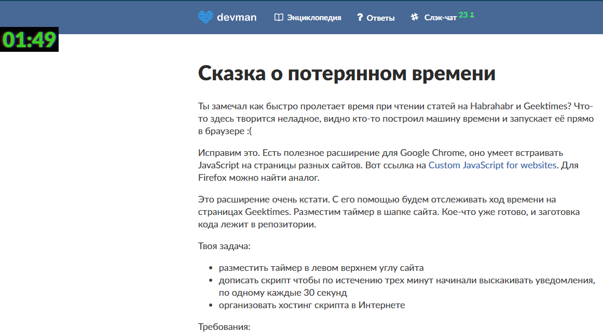

# Timer for Websites That Steal Your Time

This project helps to control time was spent on sites. It requires special extension for Chrome browser.



# Installing

Install extension for Chrome browser [Custom JavaScript for websites](https://chrome.google.com/webstore/detail/custom-javascript-for-web/poakhlngfciodnhlhhgnaaelnpjljija).

Open configuration of [cjs](https://chrome.google.com/webstore/detail/custom-javascript-for-web/poakhlngfciodnhlhhgnaaelnpjljija) browser extension on the site you want to controll. Click on the link "your own external scripts", add path
https://cdn.rawgit.com/rndviktor2devman/34_timemachine/99cf4489/index.js

After enabling the script you will see on top-left corner of the screen the timer(see screenshot), which shows time left before alarm shown. Alarm shows some motivation message and means you should go to work! :)

For faster development you can use JS code hosted on localhost. Simple web server can be used for that, run:

```bash

python3 -m http.server
```

Add path `http://localhost:8000/index.js` to [cjs](https://chrome.google.com/webstore/detail/custom-javascript-for-web/poakhlngfciodnhlhhgnaaelnpjljija) browser extension. Done.


# Project Goals

The code is written for educational purposes. Training course for web-developers - [DEVMAN.org](https://devman.org)
